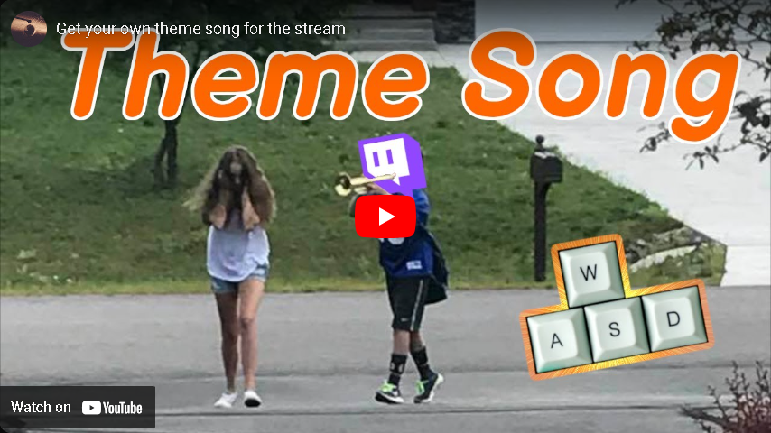

# ThemeSong (WebSocket 4 version)

## Add Theme song to your stream.
After user redeems this reward you will get your own theme song. Every time you move your theme song will be played.
You can modify which keys are triggering that. For list of values look at the [MSDN](https://learn.microsoft.com/en-us/windows/win32/inputdev/virtual-key-codes)